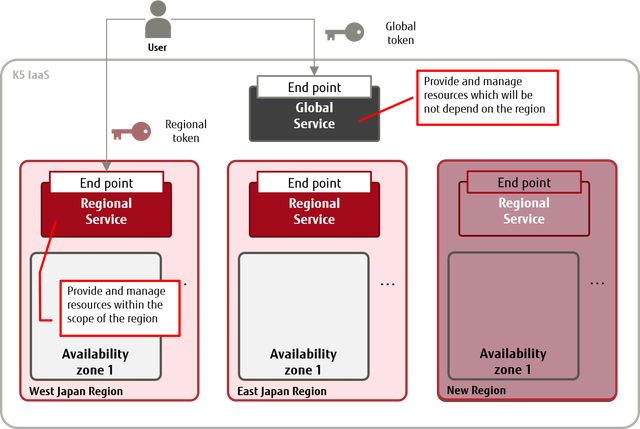

========================
Fujitsu K5 IaaS API Docs
========================

Fujitsu K5 API Services
=======================

List of K5 Portal Services
--------------------------

+-----------------------+----------------------------------------------------------+---------------+
| Name of Service       | Endpoint                                                 | Swagger File  |
|                       |                                                          |               |
+-----------------------+----------------------------------------------------------+---------------+
| Get Portal Auth Token | https://auth-api.jp-east-1.paas.cloud.global.fujitsu.com | auth-api_     |
|                       |                                                          |               |
+-----------------------+----------------------------------------------------------+---------------+
| User Management       | https://k5-apiportal.paas.cloud.global.fujitsu.com       | k5-apiportal_ |
|                       |                                                          |               |
+-----------------------+----------------------------------------------------------+---------------+

.. _auth-api: swagger/auth-api.json
.. _k5-apiportal: swagger/k5-apiportal.json

List of K5 Global IaaS Services
-------------------------------

+----------------------------------+-----------------------------------------------+---------------------+
| Name of Service                  | Endpoint                                      | Swagger File        |
|                                  |                                               |                     |
+----------------------------------+-----------------------------------------------+---------------------+
| Get Global Auth Token            | https://identity.gls.cloud.global.fujitsu.com | auth-global_        |
|                                  |                                               |                     |
+----------------------------------+-----------------------------------------------+---------------------+
| Subscription Management          | https://contract.gls.cloud.global.fujitsu.com | contract_           |
|                                  |                                               |                     |
+----------------------------------+-----------------------------------------------+---------------------+
| Global User Management           | https://identity.gls.cloud.global.fujitsu.com | identity-ex.global_ |
|                                  |                                               |                     |
+----------------------------------+-----------------------------------------------+---------------------+
| Billing Management               | https://billing.gls.cloud.global.fujitsu.com  | billing_            |
|                                  |                                               |                     |
+----------------------------------+-----------------------------------------------+---------------------+
| DNS Service                      | https://dns.gls.cloud.global.fujitsu.com      | dns_                |
|                                  |                                               |                     |
+----------------------------------+-----------------------------------------------+---------------------+
| Product Management               | https://catalog.gls.cloud.global.fujitsu.com  | catalog_            |
|                                  |                                               |                     |
+----------------------------------+-----------------------------------------------+---------------------+
| Content Delivery Network Service | https://cdn.gls.cloud.global.fujitsu.com      | cdn_                |
|                                  |                                               |                     |
+----------------------------------+-----------------------------------------------+---------------------+

.. _auth-global: swagger/auth-global.json
.. _contract: swagger/contract.json
.. _identity-ex.global: swagger/identity-ex.global.json
.. _billing: swagger/billing.json
.. _dns: swagger/dns.json
.. _catalog: swagger/catalog.json
.. _cdn: swagger/cdn.json

List of K5 Regional IaaS Services
---------------------------------

+----------------------------+----------------------------------------------------+------------------+
| Name of Service            | Endpoint (\*** indicates the region identifier)    | Swagger File     |
|                            |                                                    |                  |
+----------------------------+----------------------------------------------------+------------------+
| Get Regional Auth Token    | https://identity.***.cloud.global.fujitsu.com      | auth-region_     |
|                            |                                                    |                  |
+----------------------------+----------------------------------------------------+------------------+
| Regional User Management   | https://identity.***.cloud.global.fujitsu.com      | identity-ex_     |
|                            |                                                    |                  |
+----------------------------+----------------------------------------------------+------------------+
| Key Management             | https://keymanagement.***.cloud.global.fujitsu.com | keymanagement_   |
|                            |                                                    |                  |
+----------------------------+----------------------------------------------------+------------------+
| Software Management        | https://software.***.cloud.global.fujitsu.com      | software_        |
|                            |                                                    |                  |
+----------------------------+----------------------------------------------------+------------------+
| Compute (Standard Service) | https://compute.***.cloud.global.fujitsu.com       | .                |
|                            |                                                    |                  |
+----------------------------+----------------------------------------------------+------------------+
| Image Management           | https://image.***.cloud.global.fujitsu.com         | image-ex_        |
|                            |                                                    |                  |
+----------------------------+----------------------------------------------------+------------------+
| Virtual Server Import      | https://vmimport.***.cloud.global.fujitsu.com      | vmimport_        |
|                            |                                                    |                  |
+----------------------------+----------------------------------------------------+------------------+
| Compute (Service for SAP)  | https://compute-w.***.cloud.global.fujitsu.com     | compute-w_       |
|                            |                                                    |                  |
+----------------------------+----------------------------------------------------+------------------+
| Auto-Scaling               | https://autoscale.***.cloud.global.fujitsu.com     | autoscale_       |
|                            |                                                    |                  |
+----------------------------+----------------------------------------------------+------------------+
| Block Storage              | https://blockstorage.***.cloud.global.fujitsu.com  | blockstorage-ex_ |
|                            |                                                    |                  |
+----------------------------+----------------------------------------------------+------------------+
| Object Storage             | https://objectstorage.***.cloud.global.fujitsu.com | .                |
|                            |                                                    |                  |
+----------------------------+----------------------------------------------------+------------------+
| Virtual Network            | https://networking.***.cloud.global.fujitsu.com    | .                |
|                            |                                                    |                  |
+----------------------------+----------------------------------------------------+------------------+
| Virtual Network Extension  | https://networking-ex.***.cloud.global.fujitsu.com | networking-ex_   |
|                            |                                                    |                  |
+----------------------------+----------------------------------------------------+------------------+
| Load Balancer              | https://loadbalancing.***.cloud.global.fujitsu.com | loadbalancing_   |
|                            |                                                    |                  |
+----------------------------+----------------------------------------------------+------------------+
| Database                   | https://database.***.cloud.global.fujitsu.com      | database_        |
|                            |                                                    |                  |
+----------------------------+----------------------------------------------------+------------------+
| Email Delivery             | https://mail.***.cloud.global.fujitsu.com          | mail_            |
|                            |                                                    |                  |
+----------------------------+----------------------------------------------------+------------------+
| Orchestration              | https://orchestration.***.cloud.global.fujitsu.com | .                |
|                            |                                                    |                  |
+----------------------------+----------------------------------------------------+------------------+
| Monitoring                 | https://telemetry.***.cloud.global.fujitsu.com     | .                |
|                            |                                                    |                  |
+----------------------------+----------------------------------------------------+------------------+

.. _auth-region: swagger/auth-region.json
.. _identity-ex: swagger/identity-ex.json
.. _keymanagement: swagger/keymanagement.json
.. _software: swagger/software.json
.. _image-ex: swagger/image-ex.json
.. _vmimport: swagger/vmimport.json
.. _compute-w: swagger/compute-w.json
.. _autoscale: swagger/autoscale.json
.. _blockstorage-ex: swagger/blockstorage-ex.json
.. _networking-ex: swagger/networking-ex.json
.. _loadbalancing: swagger/loadbalancing.json
.. _database: swagger/database.json
.. _mail: swagger/mail.json

Using the draft swagger files
=============================

You can explore the different Fujitsu K5 IaaS APIs by using the swagger files with one of the Swagger tools like:

* `Swagger Editor <http://editor.swagger.io/>`_

* `Swagger UI <http://petstore.swagger.io/>`_

You can also generate draft client SDKs in your preferred programming language using Swagger Codegen or directly from the Swagger Editor, or use the swagger files as input for an API gateway or other integration tool.

Note: since the parameters and responses in the swagger files are not always complete, this will not give you a fully functional tool, but it should give you a start.

Getting the right authentication token
======================================

The Fujitsu K5 services are organised in **global services** and **regional services**.

Source: `FUJITSU Cloud Service K5 IaaS Features Handbook <http://www.fujitsu.com/global/Images/k5-iaas-features-handbook.pdf>`_

In addition, the central **K5 portal** also has a separate authentication service. Please make sure to use the right authentication token when trying out one of the APIs...

Swagger files
=============

* `swagger <swagger>`_: Draft swagger files for Fujitsu K5 IaaS API Extensions (get an auth_token from identity.* first)

* `developer.openstack.org/draft/swagger <developer.openstack.org/draft/swagger>`_: Draft Swagger files generated by Openstack developer

* `rackerlabs-wadl2swagger/openstack <rackerlabs-wadl2swagger/openstack>`_: Old Swagger files converted from WADL by wadl2swagger
